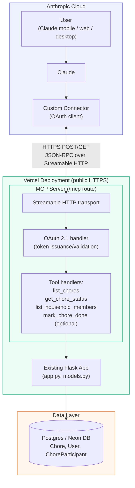

# Kensal House Mama — MCP Server Architecture

Remote MCP server exposing chore/household data to Claude (web, desktop, mobile) via a custom connector, per the [MCP Streamable HTTP transport spec](https://modelcontextprotocol.io/docs/develop/build-server) and [Claude custom connector docs](https://support.claude.com/en/articles/11175166-getting-started-with-custom-connectors-using-remote-mcp).

## Flow

1. **User asks Claude** (any surface, including mobile) about chore status.
2. **Claude** determines the custom connector's tool (e.g. `list_chores`) is relevant and calls it.
3. **Connector** sends an authenticated JSON-RPC request over **Streamable HTTP** to the MCP server's public `/mcp` endpoint — reachable from Anthropic's cloud, not the user's device.
4. **OAuth handler** validates the bearer token/session before allowing tool execution (per MCP auth spec — no shared static secrets over the open internet).
5. **Tool handlers** query existing `models.py` (Chore, User, ChoreParticipant) through the current Flask/SQLAlchemy app.
6. **Postgres (Neon)** returns chore/assignment data, which flows back through the same path to Claude, which renders a natural-language answer.

## Key constraints from official docs

- Must use **Streamable HTTP** (not stdio) since Claude mobile/web only supports remote MCP servers.
- Server must be reachable over the **public internet** — no VPN/firewall-gated access, since requests originate from Anthropic's servers.
- Requires **OAuth 2.1** (or equivalent token auth) — Claude connects on the user's behalf without exposing a password.
- Configured once as a **custom connector** in Claude settings (Customize → Connectors), then toggled on per conversation.
